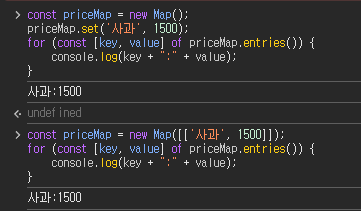

1. 답: const discount = 0.1;

2.

```
const price = 1500;
const qty = 3;
let total = price * qty;
console.log(total);
```

답: 4500

3.

```
const stock = 0;
let result = stock <= 0 ? '품절' : '구매 가능';
console.log(result);
```

답: '품절'

4. 답: 3

5.

```
const item = {name: '귤', price: 1200};
let total = 0;
total += item.price;
console.log(total);
```

답: 총액은 1200원

6.

```
const arr = [1500, 2000, 1500];
let total = 0;
for (const price of arr) {
    total += price;
}
console.log(total);
```

답: 5000

7.



8.

```
const set = new Set([101, 101, 102, 103, 103, 103]);
console.log(set.size);
```

답: 3

9. 답: for ... of
